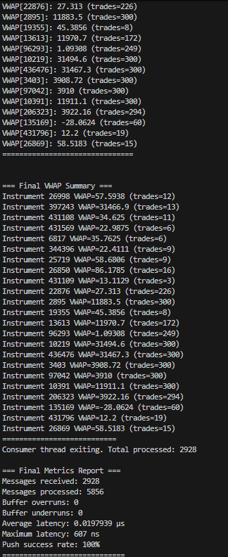

# Market Data Engine
Low-latency system that consumes live market data from Databento, passes it through a lock-free ring buffer, and processes it in a separate thread to compute a simple real-time statistic.

## Features

- **Lock-Free MPMC Queue**: High-performance lock-free ring buffer for concurrent data processing
- **Databento Integration**: Seamless integration with Databento C++ API
- **BBO Schema Support**: Optimized for Best Bid/Offer (BBO) historical data
- **Asynchronous Processing**: Non-blocking data fetching and processing
- **Performance Metrics**: Built-in monitoring and statistics

## Architecture

```
┌─────────────────┐    ┌──────────────────────┐    ┌─────────────────┐
│   Databento     │    │   MPMC Lock-Free     │    │   Consumer      │
│   Historical    │───▶│   Ring Buffer        │───▶│   Threads       │
│   API           │    │   (1M capacity)      │    │  (VWAP + book)  │
└─────────────────┘    └──────────────────────┘    └─────────────────┘
```

## Building

### Prerequisites

- C++17 compatible compiler (GCC 7+, Clang 5+, MSVC 2017+)
- CMake 3.14+
- Databento C++ SDK
- API key from [Databento](https://databento.com)

### Build Instructions

```bash
# Clone and setup the project
git clone https://github.com/Neelaksh-Singh/market_data_engine.git
cd market_engine_data

# Set your Databento API key as environment variable
export DATABENTO_API_KEY=<"your-api-key-here">

# Create build directory
mkdir build
cd build

# Configure with CMake
cmake .. -DCMAKE_BUILD_TYPE=Release

# Build
make -j$(nproc)

# Run the Engine
./market_engine_data
```

## Configuration

### Config File (`include/Config.hpp`)

The system uses a header-only configuration file that allows easy customization of all parameters without recompilation of dependencies.

### Configuration Options

#### Queue Parameters
- **QUEUE_SIZE**: Ring buffer capacity (default: 1M messages)

#### Databento Parameters
- **DATASET**: Databento dataset (e.g., "GLBX.MDP3" for CME futures)
- **SYMBOLS**: List of instruments to fetch (ES, NQ, YM futures)
- **START_TIME/END_TIME**: Historical data time range (ISO format)
- **SCHEMA**: Data schema ("bbo-1s" for 1-second BBO data)
- **FETCH_TIMEOUT_SECONDS**: Maximum wait time for data fetch

#### Logging Parameters
- **ENABLE_SAMPLE_OUTPUT**: Enable/disable sample data printing
- **SAMPLE_PRINT_EVERY**: Print sample data every N messages

### Environment Variables

- `DATABENTO_API_KEY`: Your Databento API key (required)

## Sample Output

<div align="center">

| Initial Processing | Performance Metrics |
|:------------------:|:------------------:|
|  |  |

</div>

The consumer thread processes market data and provides:
- Real-time VWAP calculations per instrument
- Sample data points every 1000 messages
- Performance reports every 5 seconds
- Final summary with complete statistics

## Data Structure

### MarketDataPoint

```cpp
struct MarketDataPoint {
    double bid_px;           // Best bid price
    double ask_px;           // Best ask price
    int64_t timestamp_delta; // Event timestamp (nanoseconds since epoch)
    int32_t instrument_id;   // Instrument identifier
    uint32_t bid_sz;         // Bid size
    uint32_t ask_sz;         // Ask size
};
```

### Performance Metrics

The handler provides real-time performance monitoring:

- `messages_received`: Total messages received from Databento
- `messages_processed`: Total messages successfully processed
- `total_latency_ns`: Cumulative processing latency
- `max_latency_ns`: Maximum observed latency
- `buffer_overruns`: Queue full events
- `buffer_underruns`: Queue empty events
- `avg_latency_us()`: Average latency in microseconds
- `push_success_rate()`: Queue insertion success rate

## Supported Schemas

- **BBO-1s**: Best Bid/Offer at 1-second intervals
- **BBO-1m**: Best Bid/Offer at 1-minute intervals

## Configuration

### Environment Variables

- `DATABENTO_API_KEY`: Your Databento API key

### CMake Options

- `CMAKE_BUILD_TYPE`: Set to `Release` for production, `Debug` for development
- `CMAKE_CXX_STANDARD`: C++ standard (default: 17)

## Performance Considerations

1. **Queue Size**: Default queue capacity is 1M messages. Adjust based on your data volume and processing speed.

2. **Batch Processing**: For high-frequency data, consider batching multiple records before processing.

3. **Consumer Threads**: Use multiple consumer threads for parallel processing of market data.

4. **Memory Alignment**: The MarketDataPoint structure is packed and cache-line aligned for optimal performance.

## Troubleshooting

### Common Issues

1. **Build Errors**: Ensure Databento C++ SDK is properly installed and CMake can find it.

2. **API Key Issues**: Verify your `DATABENTO_API_KEY` environment variable is set correctly.

3. **Queue Overruns**: If you see many buffer overruns, increase queue size or add more consumer threads.

4. **Connection Issues**: Check your internet connection and Databento API status.

### Debug Mode

Enable debug mode by building with:

```bash
cmake .. -DCMAKE_BUILD_TYPE=Debug
make
```

## License

This project is licensed under the MIT License - see the LICENSE file for details.

## Contributing

1. Fork the repository
2. Create a feature branch
3. Commit your changes
4. Push to the branch
5. Create a Pull Request

## Support

For issues related to:
- **Databento API**: Contact [Databento Support](https://databento.com/support)
- **This Implementation**: Open an issue in the repository

## Acknowledgments

- [Databento](https://databento.com) for providing the market data API
- The C++ community for lock-free queue implementations